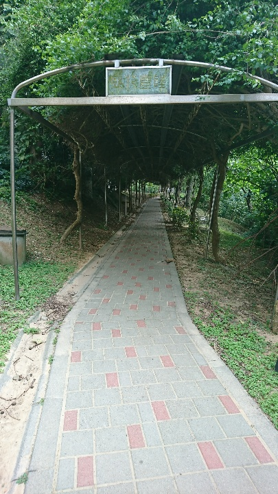
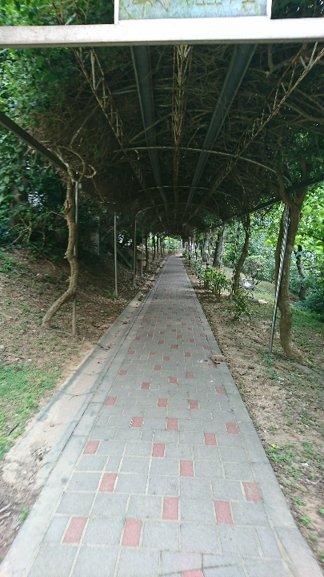
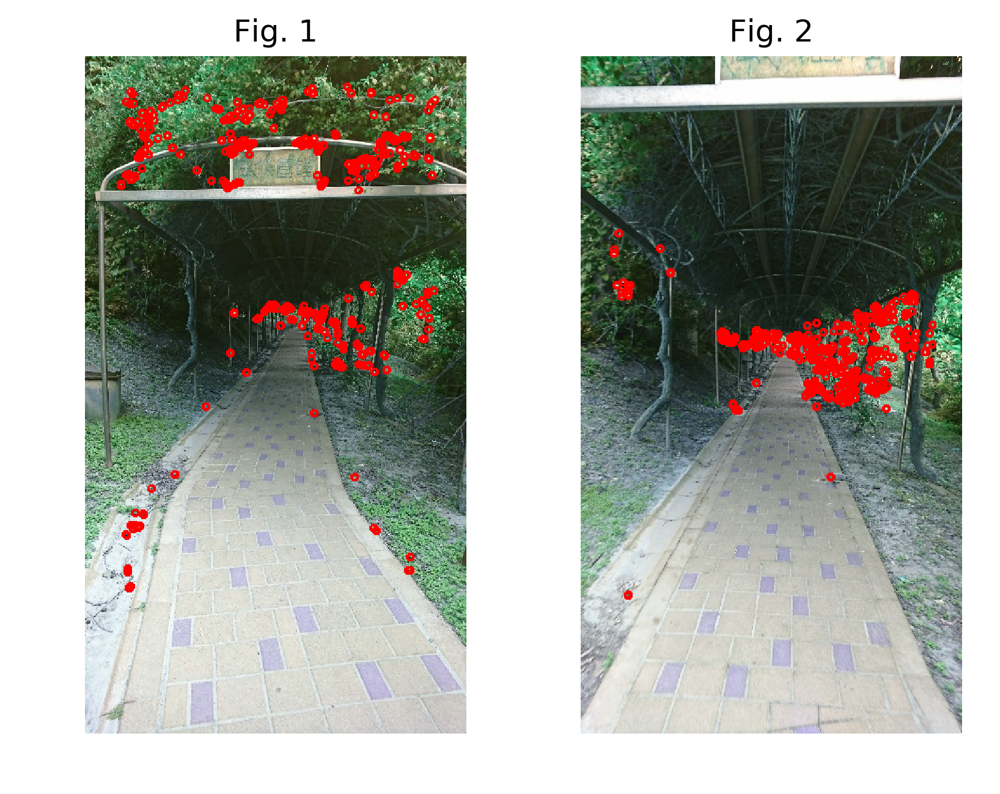
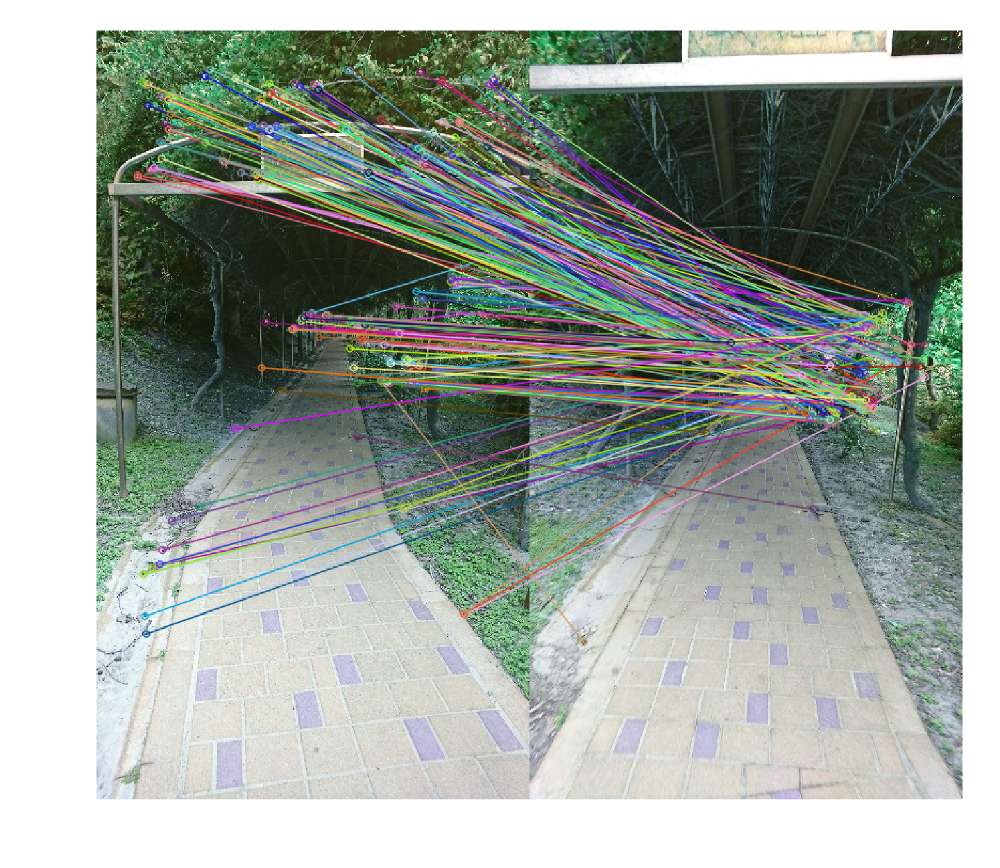
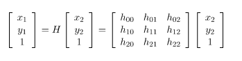
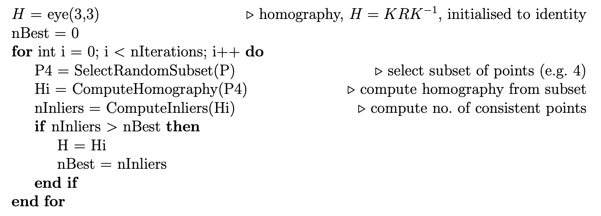

# CVFX Homework 4

## A sequence of images in NTHU campus
We have totally taken 15 moving-forward images in NTHU.

|Fig. 1|Fig. 2|
|-----------|------------|
|||

## Key points and feature matching
We plot orb feature for the two examples.

For each correspondence, we plot a line to connect them.

## Homography
When we have a set of several correspondence. We can find a homography to align these points.

Since we usually take h22 as one, we only have eight freedom to solve. As a result, we need at least eight correspondences to solve it.

However, to find a general and robust homography, we need to remove outliers and find the optimal solution. Here, **RANSAC** (RANdom SAmple Consensus) is usually applied.

Each time we randomly select eight correspondence and caluculate a homography. If the summation of reprojection error of all correspondence is lower than a threshold, we choose it as our final homography.

## Results of different feature extractors
We try three different feature extractors, which are ORB, SIFT, and SURF. In general, we found the quality of SURF is the best and robust.

|ORB|SIFT|SURF|
|---|---|---|
|||

We add some image processing to enhance effect. For example, horizontal flip, monochrome color, Lomo and Polaroid filters on the results.

|ORB|SIFT|SURF|
|---|---|---|
|||
